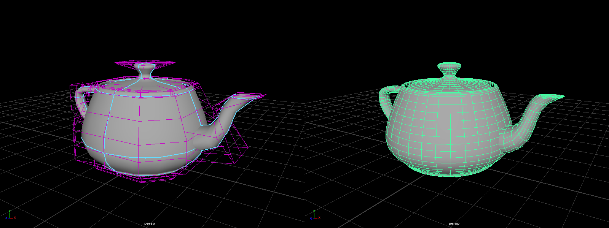

# Maya scripts & plugins
Simple scripts and utility plugins. CMake system was adopted from [Chad Vernon - cgcmake](https://github.com/chadmv/cgcmake)

## Utah Teapot primitive

C++ plugin to create NURBS and polygon geometry primitive from the Utah Teapot dataset

