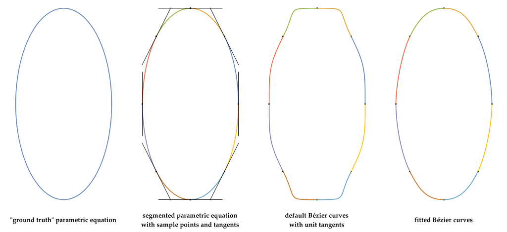
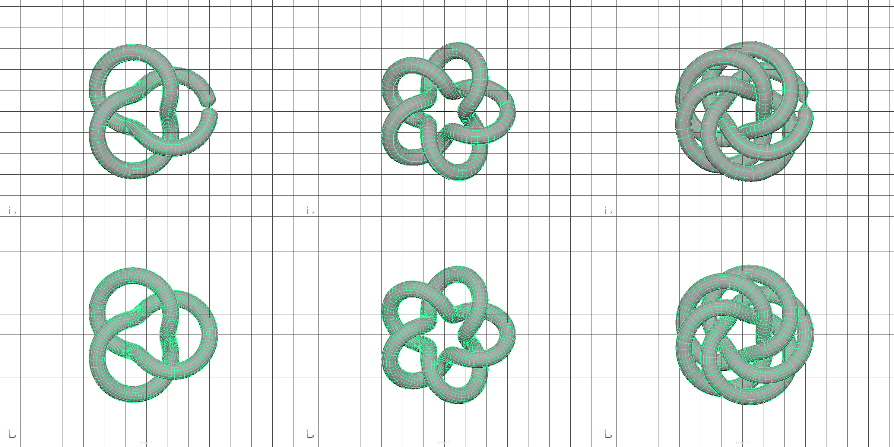

# Maya scripts & plugins
Simple scripts and utility plugins. CMake system was adopted from [Chad Vernon - cgcmake](https://github.com/chadmv/cgcmake)

Tested with Visual Studio 16 2019 (x64) with v140 platform toolset.

## Utah Teapot primitive

C++ plugin to create NURBS and polygon geometry primitive from the Utah Teapot dataset

## Torus Knot primitive

Approximating (least-squares fit) the parametric equation of (p,q)-torus knots with a series of Bézier curves joined end to end

## Issues:
* Torus Knot - extruding a profile along the torus knot curve results in a NURBS surface that pinches at the start-end of the curve
* Torus Knot - poly torus knot utility generates surface that exhibits polygon flow distortion (TNB frame)
